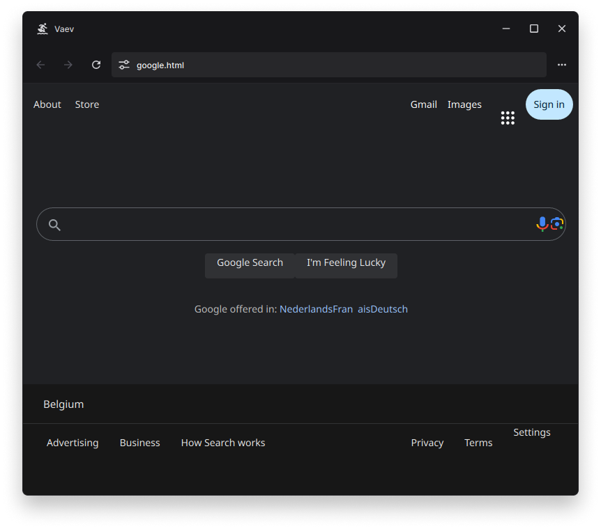

<br/>
<br/>
<br/>
<p align="center">
    
</p>
<p align="center">
    An experimental web browser engine
</p>
<br/>

## Features

VAEV currently supports a subset of web standards, including:

- Most display types (excluding grid)
- Standard CSS cascade behavior
- Pagination using @page rules
- Print-to-PDF output
- All CSS units, including percentages, var(), and calc()
- Loading of HTML and XHTML documents
- Very basic networking, only `http://` and `file://` is supported

For detailed compatibility and feature tracking, see our [WPT status page](https://vaev-org.github.io/wpt-status/)

## Chrome

<p align="center">
    
</p>

VAEV implements a simple browser chrome featuring basic navigation and devtools.

## Trying It Out

You can try out VAEV by running the following command at the root of this repository:

```bash
./ck run --release vaev-browser -- file.html
```

## Architecture

An [architecture diagram](diagrams.tldr) is available next to this file. It's in the tldraw format.

## Authors

 - [Clémence Van Bossuyt](https://github.com/sleepy-monax)
 - [Emirhan Tala](https://github.com/Emivvvvv)
 - [Lou Habert](https://github.com/Louciole)
 - [Lucien Fiorini](https://github.com/ananas-dev)

### Past Authors

 - [Lune Mercier](https://github.com/LuneMercier)
 - [Paulo Medeiros](https://github.com/pauloamed)

## 88x31 Button

[](doc/engine.md)
