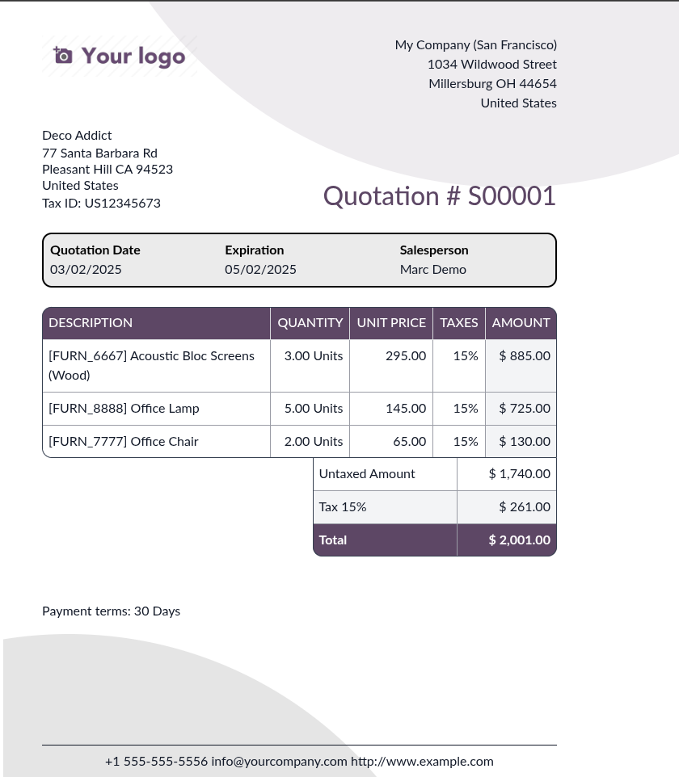
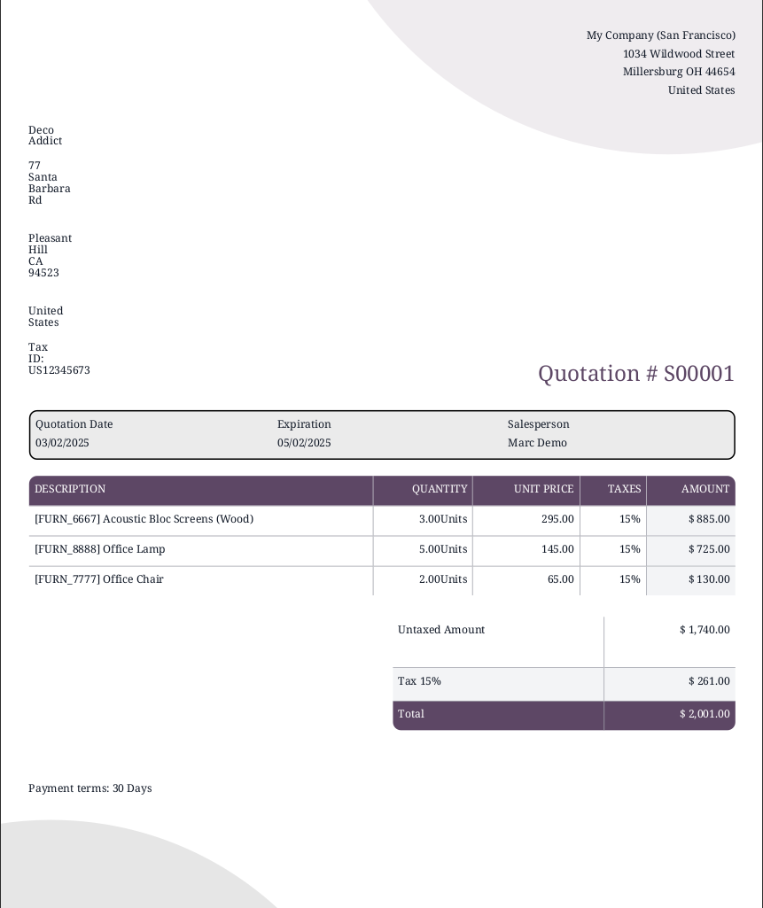
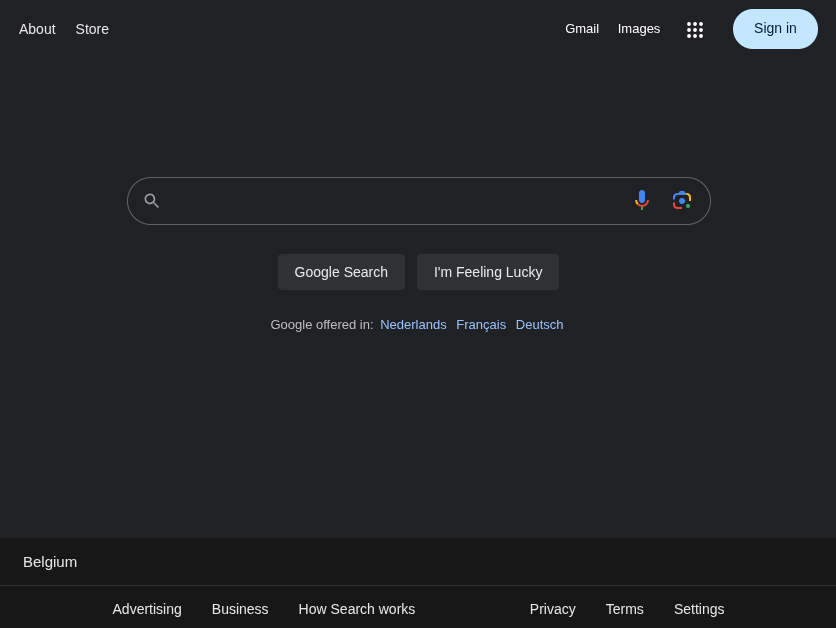
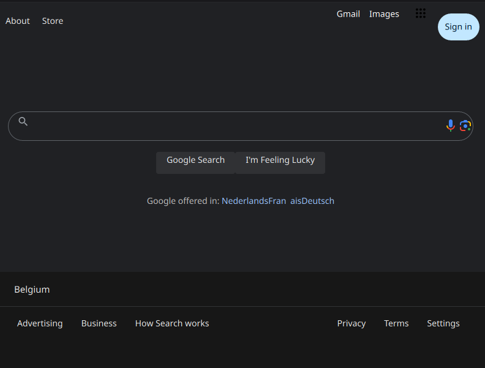
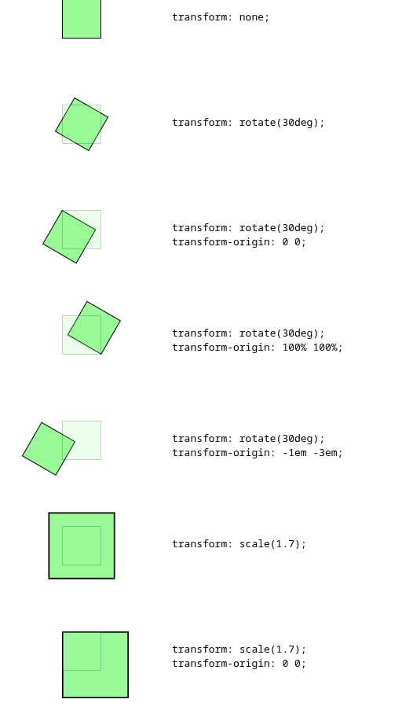
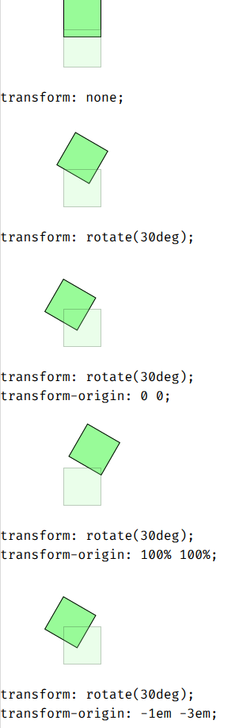

<style>
    #munchkin {
        float: right;
        width: 6rlh;
        height: 6rlh;
        margin-left: 1rem;
    }

    .note {
        border-left: 0.25rem solid #0377fc;
        padding: 0 1rem;
        margin: 1rem 0;
    }

    .center {
        text-align: center;
        display: flex;
        gap: 1rem;
        flex-direction: column;
        margin: 0 auto;
    }

    .medium {
        width: 50%;
    }

    .btn{
        background: var(--accent);
        color: var(--background-color);
        padding: 0.5rem 1rem;
        border-radius: 0.25rem;
    }

    .comparison {
        display: flex;
        gap: 1rem;
    }

    .comparison img {
        width: 50%;
    }

    .legend {
        font-size: 0.75rem;
        color: var(--text-muted);
    }

</style>

# Munch the web into crisp documents

❓️ **Paper-Muncher** is a next-generation HTML to PDF renderer running on it's own web engine.<br>
Produce beautiful, print-ready documents from web pages fast, without struggle. It's free, open source and available
right now.


<div class="note">
    Paper-Muncher is now in alpha. We're currently focused on improving our CSS compliance. While it's
    still early days, the project is functional enough to try out, and we're actively looking for feedback. The direction
    may still evolve, but you can already get a feel for where we're headed. Let us know what you think in
    the <a href="https://github.com/odoo/paper-muncher/issues">GitHub issues</a>!
</div>

## Installation

<div class="center medium">
    <a class="btn" href="https://github.com/odoo/paper-muncher/releases/tag/nightly">Download latest Debian release</a>
    <a class="btn" href="./install.html">Build From sources</a>
</div>

## Paper Muncher in action

###Bubble sale order
<div class="comparison">
    
    
</div>


###SVG tiger
<div class="comparison">
    
    
</div>


###Paginated documents
<div class="comparison">
    
    
</div>


###Google
<div class="comparison">
    
    
</div>


###Images
<div class="comparison">
    
    
</div>


[//]: # (###Transforms)

[//]: # (<div class="comparison">)

[//]: # (    )

[//]: # (    )

[//]: # (</div>)


<div class="center medium">
    <a class="btn" href="./assets/human-rights.pdf">Download The paginated Universal Declaration of Human Rights</a>
    <a class="legend" href="https://www.un.org/en/about-us/universal-declaration-of-human-rights">source</a>
</div>

## Usage

```bash
paper-muncher <input.html> <output.pdf> [options]
```

---


